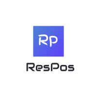

# Restaurant Point of Sales Web App

    

## Link to deployed webiste:

https://ccc012110-t4a3.herokuapp.com/

## Link to Git Repo

https://github.com/alam1704/pos_app

## Purpose

The purpose of the simple Python Flask app is to allow a restaurant owner to have free access to open-source web application that will help manage their sales and expenditure data for tax purposes. The web application will provide its users with a more streamlined approach in handling orders, adding items to cart, and finishing the sale as well as allowing restaurant owners to record all tax deductible expenses on the one application. Reports can be customised based on dates (daily, weekly, monthly, yearly etc.)

## Target Audience

Any Restaurant Owners who need a modern Web App POS to keep track of their sales and be able to export the database for tax purposes.

 

## Libraries attempted in the app

- Flask: Python Web framework using features of url routing and rendering templates. Implement EC2 for running flask.
- Intended to use Amazon Cognito services for login authentication.
- Amazon RDS for relational database for storing orders and transaction details
- Amazon DynamoDB for storing menu data. 

# Proposed Architecture Diagram

## Possible Tech Stack

Will implement REST API Gateway

| Module Name | Tech | Comments |
| --- | --- | --- |
| Backend services | Python/Flask running on Amazon EC2 Instance |  Building own services using Python and Flask as the main framework and using a cloud container |
| Authentication and Authorisation | Amazon Cognito | Will be using flask's built-in package for authentication for local devices then migrating to Amazon's Cognito Service |
| Database SQL | Amazon RDS | Will help store all transaction histories for sale and incoming supplier costs. Was considering Amaazon Aurora as the preferred Relational DB however, I do not expect my app to scale too much and opted for RDS instead. | 
| Database NoSQL | Amazon DynamoDB | Will help store menu item information including cost, description and images |
| UI | Jinja2+Bootstrap/Angular | Will implement Bootstrap initially and then hopefully be able to move across platform with Angular given there's time |

## Functionality/Features

- Order placement: restaurant owner/assistant can place an order of selected dishes and food then proceed to checkout (Note: this application will not integrate a payment gateway; only a solution to record transactions)

- If a manual entry is required, user can switch from Menu selection mode to Manual Entry mode. Here a Number Pad will display for the user to manually enter amount.

- The processed order will then be sent to the kitchen with a time since order. (pending)

- Digital receipt will then be issued via email or mobile (pending)

- Restaurant Profile/Menu: The resturant owner/manager can add their restaurant details, menu, price, and description

- Monitor sales and incoming supplier costs: Monitor all food orders and supplier costs

- Analytics and report generation: Can generate insights of reports and other accounting information which will help restaurant owner identify growth and opportunities (pending)

 

# Proposed Data Flow Diagram

 

# Proposed Wireframes

## Desktop View:

 

## Tablet View:

## Mobile View:

# Project Management and Task Delegation

To help maintian agile project management methodology, I ensured the project was completed in a timely manner by delegating tasks using a Trello Board. The web application has allowed tasks to be tracked and tasks were labelled based on difficulty and importance. However, as the sole developer, all tasks have been delegated to myself. This has made things a little hard as even though I have sound python skills and front end design, I am weak using serverless technologies.  

# Trello Board Plan 

## Development Testing

[Testing Spreadsheet](/docs/test.xlsx)

